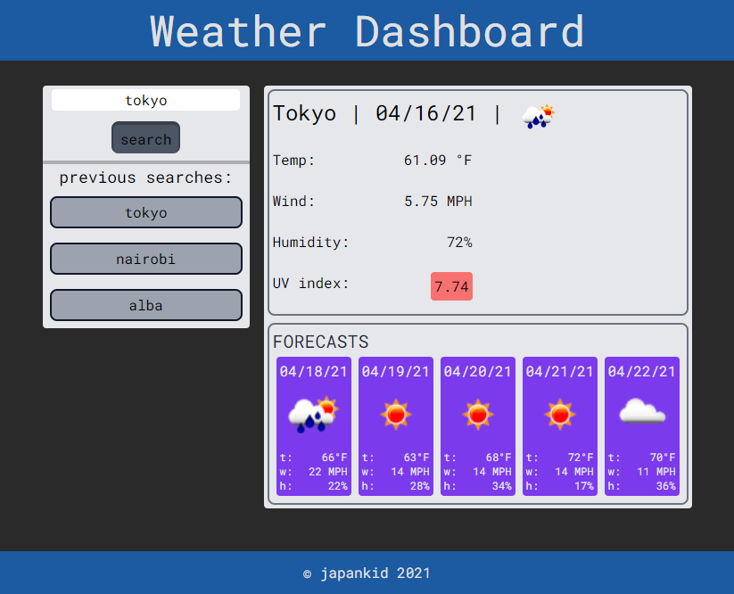

# Weather Kid

javascript server side API project.

## concept

In order to travel, I would like to see the weather outlook for different cities so I can plan a trip accordingly (because I am a nerd).

### links

in case you were wondering, site [deployed here](https://japankid-code.github.io/weather-boy), github [repo here](https://github.com/japankid-code/weather-boy).

### preview

### mockup

